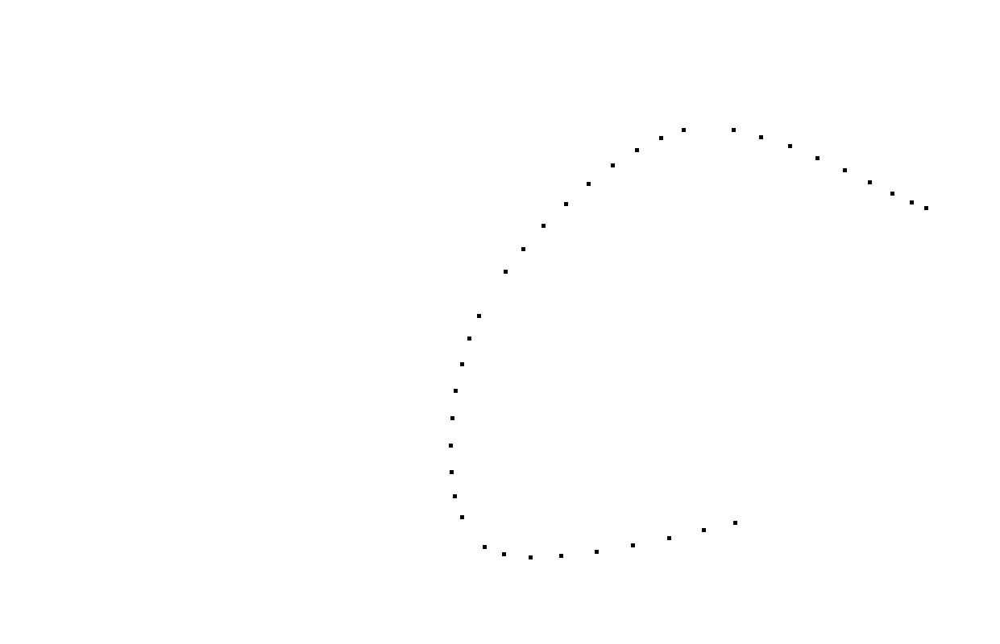
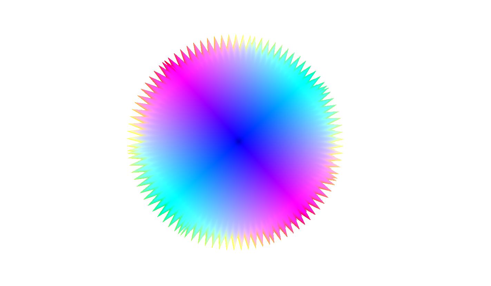

# Splines

Generating 3d shapes by drawing splines and using them for translational or rotational sweeping

## Setup

It was tested on Arch Linux.

### Dependencies

    # Arch Linux
    sudo pacman -S glew glm glfw-x11 mesa-demos

### Compiling:

    make arch       # Arch Linux
    make linux      # GNU / Linux (general)

## Usage

An example command:

    ./run.sh <name>

### Controls

    [Slines drawing]
        left mouse click    marks control points in the window
        s                   generate spline
        enter1              generates spline
        enter2              goes to next spline
        l                   switch to previous spline
        r                   switch to next spline
        c                   print cursor coordinates
        backspace           resets the application

    [Generated spline visualization]
        rotate              arrows
        w                   move forward
        s                   move backward
        a                   move left
        d                   move right
        l                   display lines
        t                   display triangles
        p                   display points

## Roadmap

### Requierements

* ~~User decides whether to have a translational “T” or rotational sweep “R” (through console)~~

* ~~The user then marks control points in the window with the mouse (assume XZ plane, Y=0). The X and Z coordinates of each point should then relate to the window coordinates where the user has clicked.~~

* ~~User can then press “Enter” which computes and draws the spline.~~
    
    * ~~If the user selected translational sweep, then repeat steps 2-3 for the second set of control points resulting in two separate splines (this time assume XY plane, Z=0). The X and Y coordinates of each point should then relate to the window coordinates where the user has clicked.~~

* ~~Write the points of the resulting spline/s to an output file. The output file should have the same description format as Assignment #1.~~

* ~~Load the output file in Assignment #1 and generate smooth surfaces based on the input splines.~~

### Sub-requierements

* ~~Create a GLFW window of size 800x800 with double buffering support~~

* ~~The application should handle window resize events~~

* ~~Use an orthographic projection for simplicity~~

* Generate indices to draw lines (l)

### Extra

* ~~Compute the sweep surfaces~~

* Use the subdivision algorithm taking into account the curvature (rather than distance) for drawing the curve

## Authors

Vsevolod (Seva) Ivanov - seva@tumahn.net
